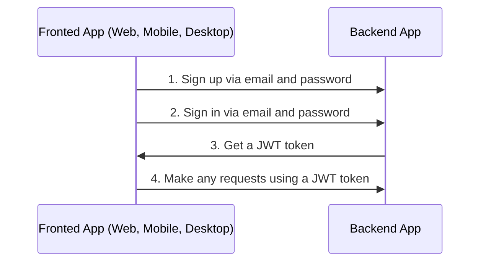
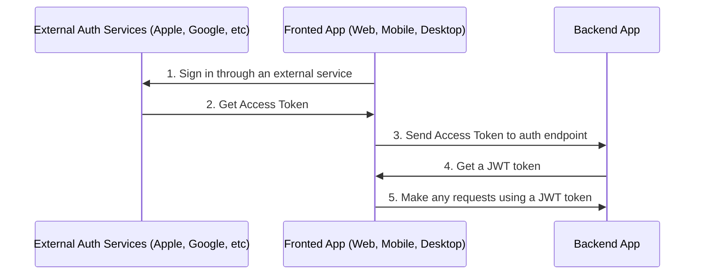

# Auth

## Table of Contents

- [General info](#general-info)
- [Configure Auth](#configure-auth)
- [Auth via Apple](#auth-via-apple)
- [Auth via Facebook](#auth-via-facebook)
- [Auth via Google](#auth-via-google)
- [Auth via Twitter](#auth-via-twitter)
- [Logout](#logout)

---

## General info

By default boilerplate used sign in and sign up via email and password.



https://user-images.githubusercontent.com/6001723/224566194-1c1f4e98-5691-4703-b30e-92f99ec5d929.mp4

Also you can sign up via another external services or social networks like Apple, Facebook, Google, and Twitter.



For auth with external services or social networks you need:

1. Sign in through an external service and get access token(s).
1. Call one of endpoints with access token received in frontend app on 1-st step and get JWT token from the backend app.

    ```text
    POST /api/v1/auth/facebook/login

    POST /api/v1/auth/google/login

    POST /api/v1/auth/twitter/login
    
    POST /api/v1/auth/apple/login
    ```

1. Make any requests using a JWT token

---

## Configure Auth

1. Generate secret keys for `access token` and `refresh token`:

    ```bash
    node -e "console.log('\nAUTH_JWT_SECRET=' + require('crypto').randomBytes(256).toString('base64') + '\nAUTH_REFRESH_SECRET=' + require('crypto').randomBytes(256).toString('base64'));"
    ```

1. Go to `/.env` and replace `AUTH_JWT_SECRET` and `AUTH_REFRESH_SECRET` with output from step 1.

    ```text
    AUTH_JWT_SECRET=HERE_SECRET_KEY_FROM_STEP_1
    AUTH_REFRESH_SECRET=HERE_SECRET_KEY_FROM_STEP_1
    ```

## Auth via Apple

1. Set up your service on Apple
1. Change `APPLE_APP_AUDIENCE` in `.env`

    ```text
    APPLE_APP_AUDIENCE=["com.company", "com.company.web"]
    ```

## Auth via Facebook

1. Set up your service on Facebook
1. Change `FACEBOOK_APP_ID` and `FACEBOOK_APP_SECRET` in `.env`

    ```text
    FACEBOOK_APP_ID=abc
    FACEBOOK_APP_SECRET=abc
    ```

## Auth via Google

1. Set up your service on Google
1. Change `GOOGLE_CLIENT_ID` and `GOOGLE_CLIENT_SECRET` in `.env`

    ```text
    GOOGLE_CLIENT_ID=abc
    GOOGLE_CLIENT_SECRET=abc
    ```

## Auth via Twitter

1. Set up your service on Twitter
1. Change `TWITTER_CONSUMER_KEY` and `TWITTER_CONSUMER_SECRET` in `.env`

    ```text
    TWITTER_CONSUMER_KEY=abc
    TWITTER_CONSUMER_SECRET=abc
    ```

## Logout

1. Call following endpoint:

   ```text
   POST /api/v1/auth/logout
   ```

1. Remove `access token` and `refresh token` from your client app (cookies, localStorage, etc).

---

Previous: [Working with database](database.md)

Next: [Serialization](serialization.md)
