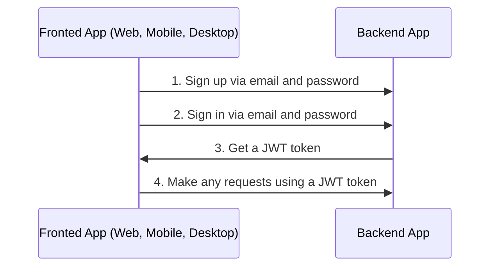
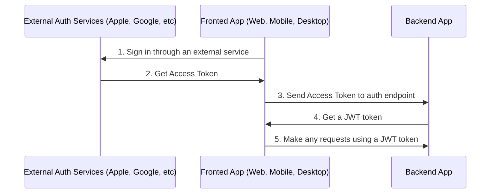

# Auth

## Table of Contents <!-- omit in toc -->

- [General info](#general-info)
  - [Auth via email flow](#auth-via-email-flow)
  - [Auth via external services or social networks flow](#auth-via-external-services-or-social-networks-flow)
- [Configure Auth](#configure-auth)
- [Auth via Apple](#auth-via-apple)
- [Auth via Facebook](#auth-via-facebook)
- [Auth via Google](#auth-via-google)
- [About JWT strategy](#about-jwt-strategy)
- [Accessing the authenticated user](#accessing-the-authenticated-user)
- [Refresh token flow](#refresh-token-flow)
  - [Video example](#video-example)
  - [Support login for multiple devices / Sessions](#support-login-for-multiple-devices--sessions)
- [Logout](#logout)
- [Security hardening](#security-hardening)
- [Q\&A](#qa)
  - [After `POST /api/v1/auth/logout` or removing session from the database, the user can still make requests with an `access token` for some time. Why?](#after-post-apiv1authlogout-or-removing-session-from-the-database-the-user-can-still-make-requests-with-an-access-token-for-some-time-why)

---

## General info

### Auth via email flow

By default boilerplate used sign in and sign up via email and password.


```mermaid
sequenceDiagram
    participant A as Fronted App (Web, Mobile, Desktop)
    participant B as Backend App

    A->>B: 1. Sign up via email and password
    A->>B: 2. Sign in via email and password
    B->>A: 3. Get a JWT token
    A->>B: 4. Make any requests using a JWT token
```

<https://user-images.githubusercontent.com/6001723/224566194-1c1f4e98-5691-4703-b30e-92f99ec5d929.mp4>

### Auth via external services or social networks flow

Also you can sign up via another external services or social networks like Apple, Facebook and Google.


```mermaid
sequenceDiagram
    participant B as External Auth Services (Apple, Google, etc)
    participant A as Fronted App (Web, Mobile, Desktop)
    participant C as Backend App

    A->>B: 1. Sign in through an external service
    B->>A: 2. Get Access Token
    A->>C: 3. Send Access Token to auth endpoint
    C->>A: 4. Get a JWT token
    A->>C: 5. Make any requests using a JWT token
```

For auth with external services or social networks you need:

1. Sign in through an external service and get access token(s).
1. Call one of endpoints with access token received in frontend app on 1-st step and get JWT token from the backend app.

   ```text
   POST /api/v1/auth/facebook/login

   POST /api/v1/auth/google/login

   POST /api/v1/auth/apple/login
   ```

1. Make any requests using a JWT token

---

## Configure Auth

1. Generate secret keys for `access token` and `refresh token`:

   ```bash
   node -e "console.log('\nAUTH_JWT_SECRET=' + require('crypto').randomBytes(256).toString('base64') + '\n\nAUTH_REFRESH_SECRET=' + require('crypto').randomBytes(256).toString('base64') + '\n\nAUTH_FORGOT_SECRET=' + require('crypto').randomBytes(256).toString('base64') + '\n\nAUTH_CONFIRM_EMAIL_SECRET=' + require('crypto').randomBytes(256).toString('base64'));"
   ```

1. Go to `/.env` and replace `AUTH_JWT_SECRET` and `AUTH_REFRESH_SECRET` with output from step 1.

   ```text
   AUTH_JWT_SECRET=HERE_SECRET_KEY_FROM_STEP_1
   AUTH_REFRESH_SECRET=HERE_SECRET_KEY_FROM_STEP_1
   ```

> The app refuses to start with `NODE_ENV=production` while any `AUTH_*_SECRET` still has the placeholder value from `env-example-*`. In development it only logs a warning.

## Auth via Apple

1. [Set up your service on Apple](https://www.npmjs.com/package/apple-signin-auth)
1. Change `APPLE_APP_AUDIENCE` in `.env`

   ```text
   APPLE_APP_AUDIENCE=["com.company", "com.company.web"]
   ```

## Auth via Facebook

1. Go to https://developers.facebook.com/apps/creation/ and create a new app
   

   
2. Go to `Settings` -> `Basic` and get `App ID` and `App Secret` from your app
   
3. Change `FACEBOOK_APP_ID` and `FACEBOOK_APP_SECRET` in `.env`

   ```text
   FACEBOOK_APP_ID=123
   FACEBOOK_APP_SECRET=abc
   ```

## Auth via Google

1. You need a `CLIENT_ID`, `CLIENT_SECRET`. You can find these pieces of information by going to the [Developer Console](https://console.cloud.google.com/), clicking your project (if doesn't have create it here https://console.cloud.google.com/projectcreate) -> `APIs & services` -> `credentials`.
1. Change `GOOGLE_CLIENT_ID` and `GOOGLE_CLIENT_SECRET` in `.env`

   ```text
   GOOGLE_CLIENT_ID=abc
   GOOGLE_CLIENT_SECRET=abc
   ```

## About JWT strategy

In the `validate` method of the `src/auth/strategies/jwt.strategy.ts` file, you can see that we do not check if the user exists in the database because it is redundant, it may lose the benefits of the JWT approach and can affect the application performance.

To better understand how JWT works, watch the video explanation https://www.youtube.com/watch?v=Y2H3DXDeS3Q and read this article https://jwt.io/introduction/

```typescript
// src/auth/strategies/jwt.strategy.ts

@Injectable()
export class JwtStrategy extends PassportStrategy(Strategy, 'jwt') {
  // ...

  public validate(payload) {
    if (!payload.id) {
      throw new UnauthorizedException();
    }

    return payload;
  }
}
```

> If you need to get full user information, get it in services.

## Accessing the authenticated user

Whatever a strategy returns from `validate()` is what Passport assigns to `request.user`. To read it in a controller with type safety, annotate the request with `RequestWithUser<T>` from [`src/utils/types/request-with-user.type.ts`](../src/utils/types/request-with-user.type.ts):

```typescript
export type RequestWithUser<TUser> = Request & {
  user: TUser;
};
```

For routes guarded by `AuthGuard('jwt')`, `T` is `JwtPayloadType` — so `request.user.id`, `request.user.role` and `request.user.sessionId` are all typed:

```typescript
// src/auth/auth.controller.ts

@Get('me')
@UseGuards(AuthGuard('jwt'))
public me(
  @Request() request: RequestWithUser<JwtPayloadType>,
): Promise<NullableType<User>> {
  return this.service.me(request.user);
}
```

`POST /api/v1/auth/refresh` is the exception: it is guarded by `AuthGuard('jwt-refresh')`, so a different strategy populates `request.user` and the payload is a `JwtRefreshPayloadType` instead:

```typescript
@Post('refresh')
@UseGuards(AuthGuard('jwt-refresh'))
public refresh(
  @Request() request: RequestWithUser<JwtRefreshPayloadType>,
): Promise<RefreshResponseDto> {
  return this.service.refreshToken({
    sessionId: request.user.sessionId,
    hash: request.user.hash,
  });
}
```

Always pass the payload type matching the guard on the route — using `JwtPayloadType` on the refresh route (or vice versa) would describe fields that do not exist at runtime.

The same type works in guards and interceptors, where the request comes from the execution context instead. `RolesGuard` may be applied to routes without an auth guard, so it allows `user` to be absent:

```typescript
// src/roles/roles.guard.ts

const request = context
  .switchToHttp()
  .getRequest<RequestWithUser<JwtPayloadType | undefined>>();
```

## Refresh token flow

1. On sign in (`POST /api/v1/auth/email/login`) you will receive `token`, `tokenExpires` and `refreshToken` in response.
1. On each regular request you need to send `token` in `Authorization` header.
1. If `token` is expired (check with `tokenExpires` property on client app) you need to send `refreshToken` to `POST /api/v1/auth/refresh` in `Authorization` header to refresh `token`. You will receive new `token`, `tokenExpires` and `refreshToken` in response.

### Video example

https://github.com/brocoders/nestjs-boilerplate/assets/6001723/f6fdcc89-5ec6-472b-a6fc-d24178ad1bbb

### Support login for multiple devices / Sessions

Boilerplate supports login for multiple devices with a Refresh Token flow. This is possible due to `sessions`. When a user logs in, a new session is created and stored in the database. The session record contains `sessionId (id)`, `userId`, and `hash`.

On each `POST /api/v1/auth/refresh` request we check `hash` from the database with `hash` from the Refresh Token. If they are equal, we return new `token`, `tokenExpires`, and `refreshToken`. Then we update `hash` in the database to disallow the use of the previous Refresh Token.

Because every refresh also rotates the `refreshToken`, the `AUTH_REFRESH_TOKEN_EXPIRES_IN` default of `30d` behaves as a rolling idle window: users who return at least once every 30 days never have to log in again, while a stolen or abandoned refresh token expires on its own.

## Logout

1. Call following endpoint:

   ```text
   POST /api/v1/auth/logout
   ```

2. Remove `access token` and `refresh token` from your client app (cookies, localStorage, etc).

## Security hardening

Security defaults the boilerplate ships with, and what is intentionally left to you:

- **Strong secrets are enforced in production.** Startup fails when `NODE_ENV=production` and any `AUTH_*_SECRET` still contains the placeholder value from `env-example-*` (see [Configure Auth](#configure-auth)).
- **HTTP security headers** are set by [helmet](https://helmetjs.github.io/) in `src/main.ts`. `Content-Security-Policy` is disabled because Swagger UI on `/docs` relies on inline scripts; enable it if you turn Swagger off.
- **CORS allow-list.** `APP_CORS_ORIGINS` accepts a comma-separated list of origins (e.g. `https://app.example.com,https://admin.example.com`). When it is not set, `FRONTEND_DOMAIN` is used; when neither is set, any origin is allowed (`*`). Requests without an `Origin` header (mobile apps, curl, server-to-server) are not affected by CORS. Credentials mode stays off because auth uses the `Authorization` header, not cookies — which is also why the `*` fallback does not leak credentials.
- **Password reset links are single-use.** The reset token is signed with a secret derived from the user's current password hash, so a link stops verifying the moment the password changes. All sessions are also revoked on reset.
- **Social providers must supply verified emails only.** `validateSocialLogin` links accounts by email, so an unverified provider email would allow taking over an existing account. Every provider service reports an `emailVerified` flag on `SocialInterface` and rejects an unverified address with `emailNotVerified`; `validateSocialLogin` refuses to use an email whose flag is not `true`, so a provider added later fails closed until it sets the flag deliberately. Note that these are equality checks against `true`, not truthiness tests — provider payloads are passed through verbatim and Apple sends `email_verified` as `'true' | 'false' | boolean`.
- **Social login cannot inherit an unconfirmed account.** An account created by `POST /api/v1/auth/email/register` stays `inactive` until its confirmation link is followed, so its password was chosen by someone who never proved they own the address. When a social login matches such an account by verified email, its `provider` and `socialId` are moved to the social identity rather than the account being handed over as-is — otherwise registering a victim's address ahead of time would let an attacker keep password access to the account the victim later signs into (account pre-hijacking). `validateLogin` rejects any provider other than `email`, so the unproven password stops working. `status` is left untouched, because `inactive` also means "deactivated by an admin".
- **Uniform auth errors (opt-in).** By default login and forgot-password return field-level errors (`notFound`, `incorrectPassword`, `emailNotExists`) that are convenient during development but reveal whether an email is registered. Set `AUTH_UNIFORM_ERRORS=true` to return a single `incorrectEmailOrPassword` error on login and a silent `204` from forgot-password for unknown emails.
- **Rate limiting is intentionally not bundled** to keep setup easy (a production-grade limiter needs shared storage such as Redis). Add it at the proxy or platform level — nginx `limit_req`, Cloudflare, or your API gateway — especially for `POST /api/v1/auth/email/login`, `POST /api/v1/auth/forgot/password`, and `POST /api/v1/auth/refresh`. For single-instance deployments, [@nestjs/throttler](https://docs.nestjs.com/security/rate-limiting) with its in-memory storage is an easy opt-in.
- **Possible future option: HttpOnly cookie sessions.** Tokens are returned in the response body so every client (web, mobile, desktop) can use the same API via the `Authorization` header. A browser-only alternative is issuing tokens as `HttpOnly` cookies, which JavaScript (and therefore XSS) cannot read — at the cost of CSRF protection, CORS-with-credentials, and a second contract for non-browser clients. The boilerplate deliberately keeps the header-based contract.

## Q&A

### After `POST /api/v1/auth/logout` or removing session from the database, the user can still make requests with an `access token` for some time. Why?

It's because we use `JWT`. `JWTs` are stateless, so we can't revoke them, but don't worry, this is the correct behavior and the access token will expire after the time specified in `AUTH_JWT_TOKEN_EXPIRES_IN` (the default value is 15 minutes). If you still need to revoke `JWT` tokens immediately, you can check if a session exists in [jwt.strategy.ts](https://github.com/brocoders/nestjs-boilerplate/blob/2896589f52d2df025f12069ba82ba4fac1db8ebd/src/auth/strategies/jwt.strategy.ts#L20-L26) on each request. However, it's not recommended because it can affect the application's performance.

---

Previous: [Database](database.md)

Next: [Serialization](serialization.md)
