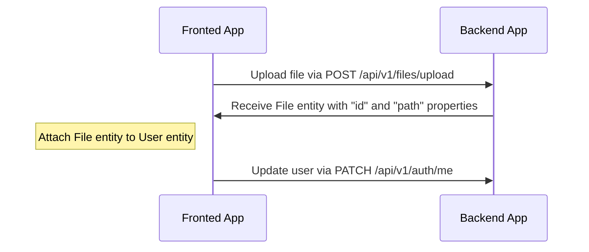

# File uploading

---

## Table of Contents

- [General info](#general-info)
- [Drivers support](#drivers-support)
- [Uploading and attach file flow](#uploading-and-attach-file-flow)
  - [An example of uploading an avatar to a user profile](#an-example-of-uploading-an-avatar-to-a-user-profile)
  - [Video example](#video-example)

---

## General info

`MulterModule` from `@nestjs/platform-express` is used to upload files. General principles you can read in [official documentation](https://docs.nestjs.com/techniques/file-upload).

---

## Drivers support

Out of box boilerplate support two drivers: `local` and `s3`. You can set it in `.env` file, variable `FILE_DRIVER`. If you want use other service for storing files, you can extend it.

---

## Uploading and attach file flow

Endpoint `/api/v1/files/upload` is used for uploading files, which return `File` entity with `id` and `path`. After receiving `File` entity you can attach this to another entity.

#### An example of uploading an avatar to a user profile

#### Video example

https://user-images.githubusercontent.com/6001723/224558636-d22480e4-f70a-4789-b6fc-6ea343685dc7.mp4

---

Previous: [Serialization](serialization.md)
