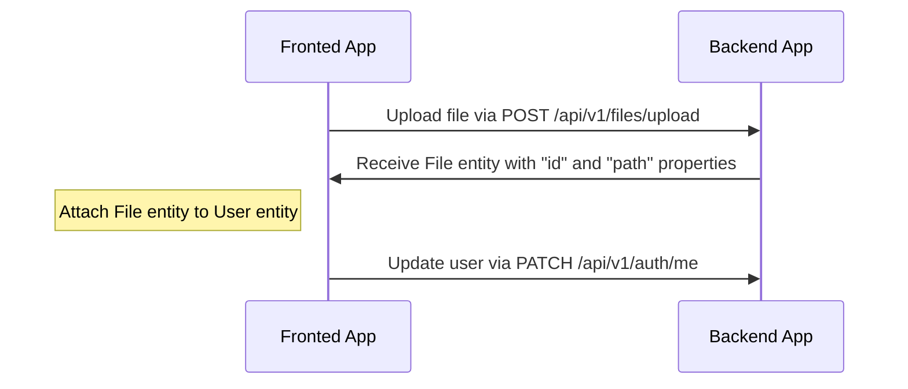
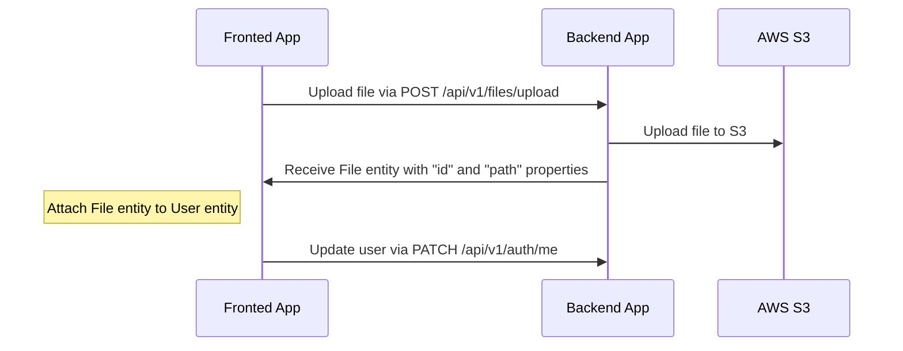
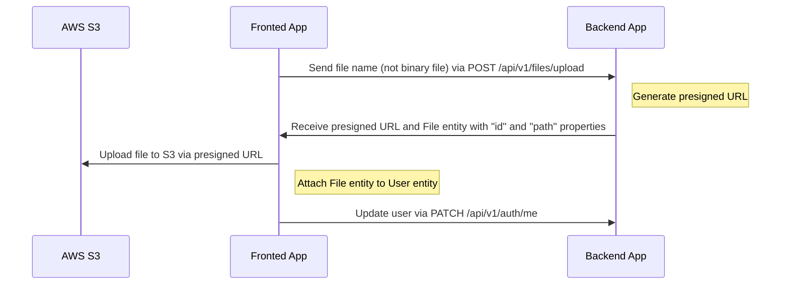

# File uploading

---

## Table of Contents <!-- omit in toc -->

- [Drivers support](#drivers-support)
- [Uploading and attach file flow for `local` driver](#uploading-and-attach-file-flow-for-local-driver)
  - [An example of uploading an avatar to a user profile (local)](#an-example-of-uploading-an-avatar-to-a-user-profile-local)
  - [Video example](#video-example)
- [Uploading and attach file flow for `s3` driver](#uploading-and-attach-file-flow-for-s3-driver)
  - [Configuration for `s3` driver](#configuration-for-s3-driver)
  - [An example of uploading an avatar to a user profile (S3)](#an-example-of-uploading-an-avatar-to-a-user-profile-s3)
- [Uploading and attach file flow for `s3-presigned` driver](#uploading-and-attach-file-flow-for-s3-presigned-driver)
  - [Configuration for `s3-presigned` driver](#configuration-for-s3-presigned-driver)
  - [An example of uploading an avatar to a user profile (S3 Presigned URL)](#an-example-of-uploading-an-avatar-to-a-user-profile-s3-presigned-url)
- [How to delete files?](#how-to-delete-files)

---

## Drivers support

Out-of-box boilerplate supports the following drivers: `local`, `s3`, and `s3-presigned`. You can set it in the `.env` file, variable `FILE_DRIVER`. If you want to use another service for storing files, you can extend it.

> For production we recommend using the "s3-presigned" driver to offload your server.

---

## Uploading and attach file flow for `local` driver

Endpoint `/api/v1/files/upload` is used for uploading files, which returns `File` entity with `id` and `path`. After receiving `File` entity you can attach this to another entity.

### An example of uploading an avatar to a user profile (local)



### Video example

<https://user-images.githubusercontent.com/6001723/224558636-d22480e4-f70a-4789-b6fc-6ea343685dc7.mp4>

## Uploading and attach file flow for `s3` driver

Endpoint `/api/v1/files/upload` is used for uploading files, which returns `File` entity with `id` and `path`. After receiving `File` entity you can attach this to another entity.

### Configuration for `s3` driver

1. Open https://s3.console.aws.amazon.com/s3/buckets
1. Click "Create bucket"
1. Create bucket (for example, `your-unique-bucket-name`)
1. Open your bucket
1. Click "Permissions" tab
1. Find "Cross-origin resource sharing (CORS)" section
1. Click "Edit"
1. Paste the following configuration

    ```json
    [
      {
        "AllowedHeaders": ["*"],
        "AllowedMethods": ["GET"],
        "AllowedOrigins": ["*"],
        "ExposeHeaders": []
      }
    ]
    ```

1. Click "Save changes"
1. Update `.env` file with the following variables:

    ```dotenv
    FILE_DRIVER=s3
    ACCESS_KEY_ID=YOUR_ACCESS_KEY_ID
    SECRET_ACCESS_KEY=YOUR_SECRET_ACCESS_KEY
    AWS_S3_REGION=YOUR_AWS_S3_REGION
    AWS_DEFAULT_S3_BUCKET=YOUR_AWS_DEFAULT_S3_BUCKET
    ```

### An example of uploading an avatar to a user profile (S3)



## Uploading and attach file flow for `s3-presigned` driver

Endpoint `/api/v1/files/upload` is used for uploading files. In this case `/api/v1/files/upload` receives only `fileName` property (without binary file), and returns the `presigned URL` and `File` entity with `id` and `path`. After receiving the `presigned URL` and `File` entity you need to upload your file to the `presigned URL` and after that attach `File` to another entity.

### Configuration for `s3-presigned` driver

1. Open https://s3.console.aws.amazon.com/s3/buckets
1. Click "Create bucket"
1. Create bucket (for example, `your-unique-bucket-name`)
1. Open your bucket
1. Click "Permissions" tab
1. Find "Cross-origin resource sharing (CORS)" section
1. Click "Edit"
1. Paste the following configuration

    ```json
    [
      {
        "AllowedHeaders": ["*"],
        "AllowedMethods": ["GET", "PUT"],
        "AllowedOrigins": ["*"],
        "ExposeHeaders": []
      }
    ]
    ```

   For production we recommend to use more strict configuration:

   ```json
   [
     {
       "AllowedHeaders": ["*"],
       "AllowedMethods": ["PUT"],
       "AllowedOrigins": ["https://your-domain.com"],
       "ExposeHeaders": []
     },
      {
        "AllowedHeaders": ["*"],
        "AllowedMethods": ["GET"],
        "AllowedOrigins": ["*"],
        "ExposeHeaders": []
      }
   ]
   ```

1. Click "Save changes"
1. Update `.env` file with the following variables:

    ```dotenv
    FILE_DRIVER=s3-presigned
    ACCESS_KEY_ID=YOUR_ACCESS_KEY_ID
    SECRET_ACCESS_KEY=YOUR_SECRET_ACCESS_KEY
    AWS_S3_REGION=YOUR_AWS_S3_REGION
    AWS_DEFAULT_S3_BUCKET=YOUR_AWS_DEFAULT_S3_BUCKET
    ```

### An example of uploading an avatar to a user profile (S3 Presigned URL)



## How to delete files?

We prefer not to delete files, as this may have negative experience during restoring data. Also for this reason we also use [Soft-Delete](https://orkhan.gitbook.io/typeorm/docs/delete-query-builder#soft-delete) approach in database. However, if you need to delete files you can create your own handler, cronjob, etc.

---

Previous: [Serialization](serialization.md)

Next: [Tests](tests.md)
